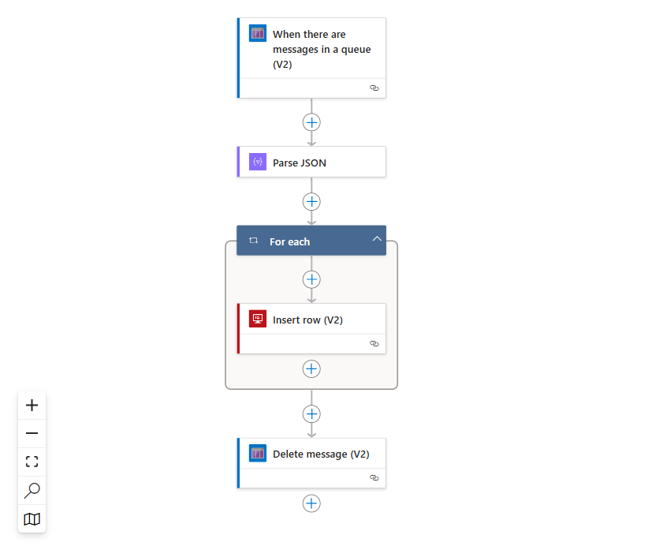
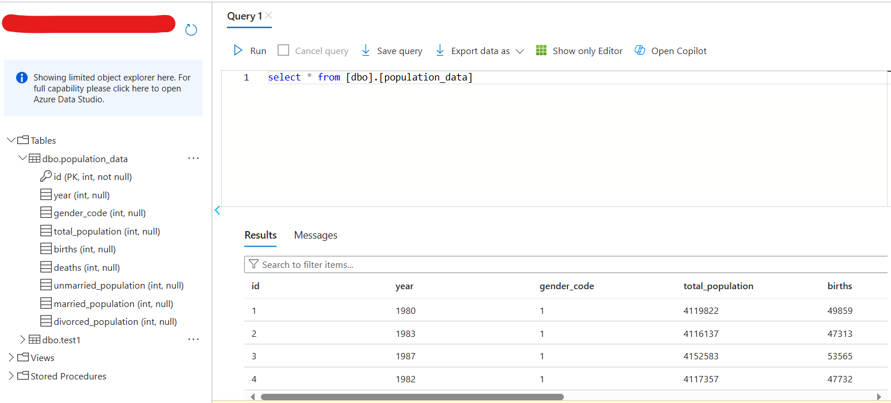
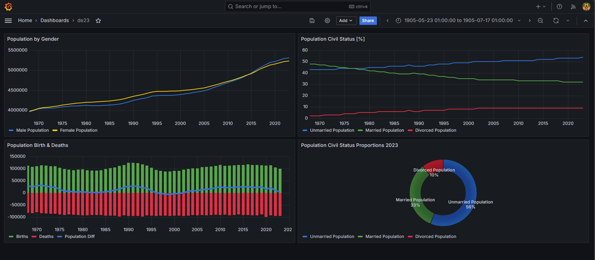

# Cloud project: Data pipeline

## Introduction
This project demonstrates a cloud based data pipeline using Azure services. The pipeline fetches data, processes and stores it in an Azure SQL Database. The data can be visualized using Grafana, PowerBI and through web interface using flask.
the key applications used in this projects are following:
+ Azure Virtual Machine
+ Azure SQL Database
+ Azure Storage using Queue
+ Azure Logic App
+ Grafana
+ PowerBI
+ Flask for HTTP data viewing

## Steps for setting up project
### 1. Setting up Azure Enviorment
**Azure applications:** Created Azure VM, Azure SQL Database (password login), Azure Storage with a Queue, and an Azure Logic App.
**Commands for initial setup in VM:**
```
sudo apt update
sudo apt -y upgrade
sudo apt -y autoremove
sudo apt -y install nano wget curl htop tmux net-tools
```
**Configure VM ports:** Open inbound ports in the Azure Portal for:
+ **Port 22:** SSH Access
+ **Port 3000:** Grafana
+ **Port 5000:** Flask for HTTP data viewing
Also add your **VM IPv4 adress** to your SQL Server

### 2. Install Python Dependencies
+ Clone this repository to your VM
```
git clone https://github.com/Jarosz96/DE23_DataMoln_Uppg1.git
```
+ Install required Python libraries
```
pip install -r requirements.txt
```
+ Rename `file.env` to `.env` and insert variables.
### 3. Creating and sending data
+ Run `create_json.py` to generate data.
+ Run `json_to_queue.py` to send data to Azure Storage Queue

### 4. Configure Azure Logic App
1. When there are messages in a queue (V2)
2. Parse JSON
3. Insert row (V2)
4. Delete message (V2)

Watch how the data goes from your Queue to the SQL Database



### 5. Grafana setup
+ Login to Grafana by visiting `http://<your-vm-ip>:3000`
+ Connect to your database, create a dashboard using your SQL data and make it public.
+ Edit grafana configuration for the dashboard to be vivible on all devices
```
sudo nano /etc/grafana/grafana.ini
```
Make following changes
```
[server]
http_addr = 0.0.0.0
http_port = 3000
domain = <your-vm-ip>
root_url = %(protocol)s://%(domain)s:%(http_port)s/
```
Restart Grafana to apply the changes
```
sudo systemctl restart grafana-server
```
Access the public dashboard through `http://your-vm-ip:3000/public-dashboards/your-dashboard-id`



### 6. PowerBI Setup
Open PowerBI and connect to your Azure SQL Database and edit your dashboard.


### 7. Flask Setup
+ Run flask application `python3 app.py`
+ Access the data at `http://<your-vm-ip>:5000`


## Price Analysis: Azure SQL Database vs PostgreSQL
For Azure SQL Database (serverless) with 4TB of data the cost can vary drasticly depending on your needs.
+ **Base price:** 728.7$
+ **Computing:** 1.72$/hour
+ **POT Restore:** 130.4$/TB
+ **Long Term Retention:** 186$/retention policy
Estimated cost for a SQL Database to be running 10h a day, monthly backup and Standard MS Support we end up with around **1554$/month**.

For Azure VM with PostgreSQL 
+ **VM cost:** 220$
+ **Price/vCore:** 76$
+ **Storage:** 137$/TB
+ **Backup:** 238$/TB (half if Locally redundant) 
Estimated cost with 8 vCores, locally redundant backup end up with **1852$/month**

When comparing these services its important to understand aspects other than just price.

| Feature                | Azure SQL Database                              | PostgreSQL                                      |
|------------------------|-------------------------------------------------|-------------------------------------------------|
| **Cost**               | Charged by CPU/compute and storage. Pay for VM, storage, and bandwidth. | Typically lower cost in self-hosted setups, but can vary depending on cloud provider. |
| **Ease of Setup**       | Extremely easy: provisioned through Azure portal with minimal configuration. | More complex: requires setting up the VM, PostgreSQL installation, and configuration. |
| **Scaling**            | Auto-scaling based on workload demand.           | Manual scaling by resizing the VM and adding storage disks.                           |
| **Administration**     | Fully managed by Azure (patching, updates, maintenance handled). | Self-managed: requires manual updates, patching, and system maintenance. |
| **Backup and Recovery** | Automatic backups with point-in-time recovery.  | Requires manual configuration of backups or use of Azure Backup services.              |
| **Customization**      | Limited to SQL Server features and Azure SQL configurations. | Full customization of PostgreSQL settings, plugins, and extensions.                   |
| **Deployment Time**    | Very quick (few minutes) to deploy and get running. | Longer setup time due to VM and database configuration.                               |
| **Control**            | Less control over system-level operations and configurations. | Full control over the system, allowing deep customization.                            |
| **Workload Types**     | Best for OLTP workloads, less suited for complex transactional queries. | Suitable for OLTP and complex workloads, highly tunable for performance.              |
